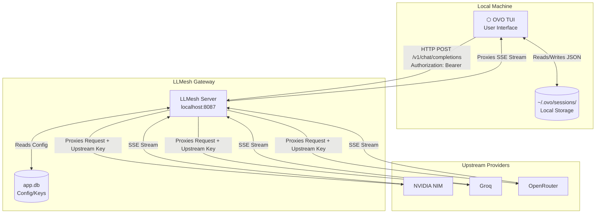

<div align="center">
  
# ⬡ OVO × LLMesh
**The Terminal-Native AI Assistant & Universal Gateway**

[](https://opensource.org/licenses/MIT)
[](https://www.python.org/downloads/)
[](https://textual.textualize.io/)

</div>

Welcome to the rebranded **OVO** and **LLMesh** ecosystem. This project combines a high-performance, stateless model proxy gateway (LLMesh) with a sleek, locally-persisted terminal user interface (OVO).

---

## ✨ Features

### 🖥️ OVO (Terminal Interface)
- **Beautiful 4:1 UI**: A heavily customized Textual interface featuring chat bubbles, a welcome screen, and a dedicated sidebar (Info Panel).
- **100% Local Sessions**: Conversations are saved directly to `~/.ovo/sessions/` as JSON. Your chat history never leaves your machine.
- **Model Status & Probing**: Auto-validates your API keys in the background and tags models (`● Key Valid`, `⚠ Rate Limited`, `✗ API Key Invalid`).
- **Slash Commands**: Powerful shortcuts like `/models`, `/session N`, `/rename`, and `/new`.
- **Task Extraction**: Automatically parses your prompts into a checklist on the sidebar.

### 🌐 LLMesh (Gateway Server)
- **Universal Provider Support**: Seamlessly routes requests to OpenAI, Groq, NVIDIA NIM, OpenRouter, and more.
- **Stateless & Private**: Routes inference requests without ever logging your prompts or responses to a database.
- **Aggressive Caching**: Sub-millisecond model routing via in-memory SQLite configuration caching.
- **Admin Dashboard**: Manage upstream keys and model configurations through the web UI on port `8087`.

---

## 🏗️ Architecture & Workflow

The architecture is explicitly designed to separate concerns: **OVO** handles all UI, context window management, and session storage, while **LLMesh** handles upstream API routing and authentication.



### The Request Lifecycle

1. **User Input**: You type a prompt into OVO and hit enter.
2. **Context Assembly**: OVO reads your local session file, compiles the `AgentState` message history, and estimates token usage.
3. **API Call**: OVO sends a standard OpenAI-compatible JSON payload to LLMesh (`http://localhost:8087/v1/chat/completions`).
4. **Routing**: LLMesh reads the requested model, grabs the appropriate upstream API key from its secure SQLite DB, and forwards the request.
5. **Streaming**: As the upstream provider generates tokens, LLMesh streams them directly back to OVO via Server-Sent Events (SSE).
6. **Persistence**: Once generation is complete, OVO automatically saves the new state back to your local `~/.ovo/sessions/` directory.

---

## 🚀 Getting Started

### 1. Start the LLMesh Gateway
First, spin up the backend server. This handles all the provider routing.
```bash
# In the LLMesh directory
export DEV=1
./start.sh
```
*The gateway will now be running on `http://localhost:8087`.*

### 2. Launch OVO
Open a new terminal window and start the interface:
```bash
ovo
```

### 3. First-Run Setup
If this is your first time, OVO will show an Onboarding screen:
1. Ensure the endpoint is `http://localhost:8087`.
2. Enter your LLMesh API Key (configured in your `.env`).
3. Hit **Connect**. 

OVO will fetch the available models and drop you into the Welcome Screen.

---

## ⌨️ Command Reference

Once inside OVO, use these slash commands in the composer:

| Command | Description |
| :--- | :--- |
| `/help` | Display the command reference |
| `/models` | View all models, their providers, and current status (Active/Rate Limited/Down) |
| `/model <N>` | Switch to a specific model by its index number |
| `/sessions` | View your locally saved conversation history |
| `/session <N>`| Restore a previous conversation |
| `/save` | Force-save the current session to disk |
| `/rename <T>` | Rename the current session |
| `/new` | Clear the screen and start a brand new session |
| `/clear` | Clear the display (keeps the session intact) |

---

## 🛠️ Configuration

### Environment Variables (`.env`)
The LLMesh server requires upstream API keys to function. Add these to your `.env` file:
```env
# Upstream Providers
GROQ_API_KEY=gsk_...
NVIDIA_NIM_API_KEY=nvapi-...
OPENROUTER_API_KEY=sk-or-v1-...

# LLMesh Auth (What you type into OVO's onboarding)
LLMESH_API_KEY=your_secure_password_here
```

### Seeding Models
LLMesh needs to know what models are available. You can manage this via the Web Dashboard, or programmatically seed them using the built-in script:
```bash
python scripts/seed_servers.py
```

<div align="center">
  <i>Built with 🖤 by the LLMesh team.</i>
</div>
